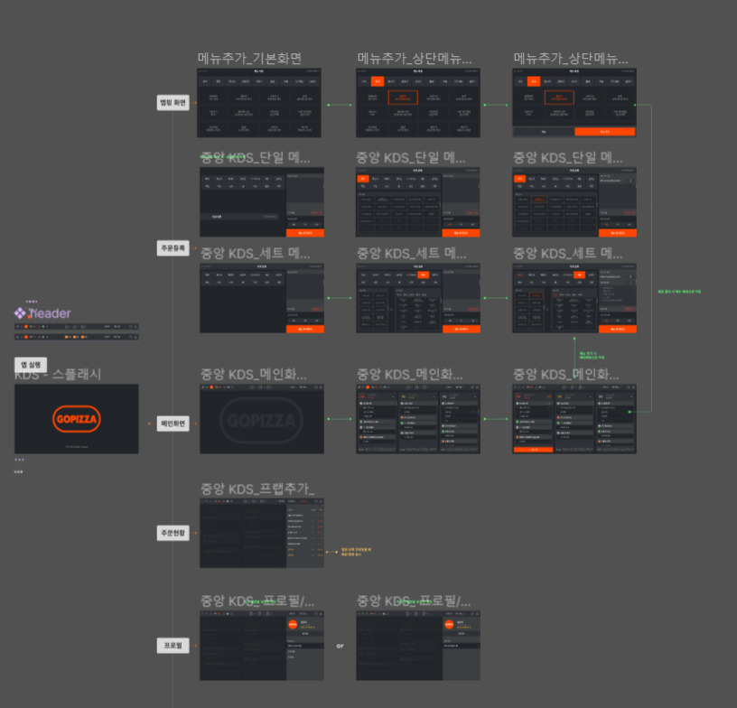

# GOPIZZA Kitchen Display System (KDS)

## 프로젝트 개요

GOPIZZA Kitchen Display System(KDS)은 피자 매장 주방의 효율적인 주문 관리를 위해 개발된 실시간 모니터링 시스템입니다. 주문 접수부터 제조 완료까지의 전체 프로세스를 디지털화하여 주방 운영 효율성을 극대화하고 고객 서비스 품질을 향상시킵니다.

KDS는 SUB KDS와 함께,  POS 시스템이나 모바일 앱, 키오스크 등 다양한 채널에서 발생한 주문을 실시간으로 수집하여 주방 스태프에게 명확하게 표시하며, 각 주문의 상태를 추적하고 관리하는 통합 솔루션입니다.





## 주요 기능

### 실시간 주문 모니터링
- **자동 주문 업데이트**: 5초 간격으로 주문 상태 자동 갱신
- **주문 상태 시각화**: 주문 대기 및 완료 상태를 시각적으로 구분
- **판매 유형 필터링**: 배달, 테이크아웃, 매장 내 식사 등 주문 유형별 필터링

### 주문 처리
- **주문 완료 처리**: 완성된 메뉴를 원터치로 완료 처리
- **애니메이션 피드백**: 주문 완료 시 시각적 애니메이션 제공
- **메모 기능**: 주문별 특별 요청 사항 표시

### 사용자 경험
- **반응형 디자인**: 다양한 디스플레이 크기에 최적화된 인터페이스
- **페이지네이션**: 다수의 주문을 효율적으로 관리하기 위한 페이지 분할
- **직관적 UI**: 주방 환경에 최적화된 심플하고 명확한 사용자 인터페이스

## 기술 스택

### 프론트엔드
- **React 18**: 사용자 인터페이스 구축을 위한 JavaScript 라이브러리
- **TypeScript**: 정적 타입 검사를 통한 코드 안정성 확보
- **MobX**: 상태 관리 라이브러리
- **React Query**: 서버 상태 관리 및 데이터 페칭
- **Emotion**: CSS-in-JS 스타일링 솔루션
- **React Router**: 클라이언트 사이드 라우팅

### 개발 도구
- **CRACO**: Create React App Configuration Override 도구
- **ESLint/Prettier**: 코드 품질 및 포맷팅 도구
- **Husky**: Git 훅을 통한 코드 품질 관리

## 프로젝트 구조

```
GoKdsFront/
├── public/                    # 정적 파일
│   └── images/                # 이미지 자산
├── src/                       # 소스 코드
│   ├── api/                   # API 호출 모듈
│   ├── components/            # 재사용 컴포넌트
│   │   ├── element/           # 기본 UI 요소
│   │   ├── receipt/           # 영수증/주문 관련 컴포넌트
│   │   ├── styles/            # 스타일 관련
│   │   └── toolbar/           # 툴바 컴포넌트
│   ├── hook/                  # 커스텀 훅
│   ├── lib/                   # 유틸리티 함수
│   ├── mobx/                  # MobX 상태 관리
│   ├── pages/                 # 페이지 컴포넌트
│   │   ├── Home.tsx           # 메인 대시보드 페이지
│   │   └── Login.tsx          # 로그인 페이지
│   ├── App.tsx                # 앱 루트 컴포넌트
│   └── index.tsx              # 진입점
├── .eslintrc.json            # ESLint 설정
├── .prettierrc.js            # Prettier 설정
├── craco.config.js           # CRACO 설정
├── tsconfig.json             # TypeScript 설정
└── package.json              # 프로젝트 의존성 및 스크립트
```

## 핵심 개발 특징

### 실시간 데이터 관리
- **React Query의 효율적 활용**: 주문 데이터의 실시간 갱신을 위한 최적화된 쿼리 설정
- **낙관적 UI 업데이트**: 서버 응답 전 UI를 선제적으로 업데이트하여 사용자 경험 향상
- **백그라운드 데이터 동기화**: 사용자 인터랙션 없이도 주문 상태 자동 갱신

### 성능 최적화
- **메모이제이션**: 불필요한 리렌더링 방지를 위한 useMemo, useCallback 활용
- **효율적인 상태 관리**: MobX를 활용한 전역 상태 관리 최적화
- **코드 스플리팅**: 필요한 코드만 로드하여 초기 로딩 속도 개선

### 사용자 인터페이스
- **직관적인 상태 표시**: 주문 상태에 따른 색상 차별화 (대기: 회색, 완료: 노란색)
- **부드러운 전환 효과**: CSS 트랜지션을 활용한 자연스러운 UI 상태 변화
- **반응형 디자인**: 다양한 화면 크기에 대응하는 적응형 레이아웃

## 설치 및 실행 방법

### 요구사항
- Node.js 14.x 이상
- npm 또는 yarn 패키지 매니저

### 설치
```bash
# 저장소 클론
git clone https://github.com/your-username/GoKdsFront.git

# 프로젝트 디렉토리로 이동
cd GoKdsFront

# 의존성 설치
npm install
# 또는
yarn install
```

### 개발 서버 실행
```bash
npm start
# 또는
yarn start
```
개발 서버는 http://localhost:3000 에서 실행됩니다.

### 프로덕션 빌드
```bash
npm run build
# 또는
yarn build
```


